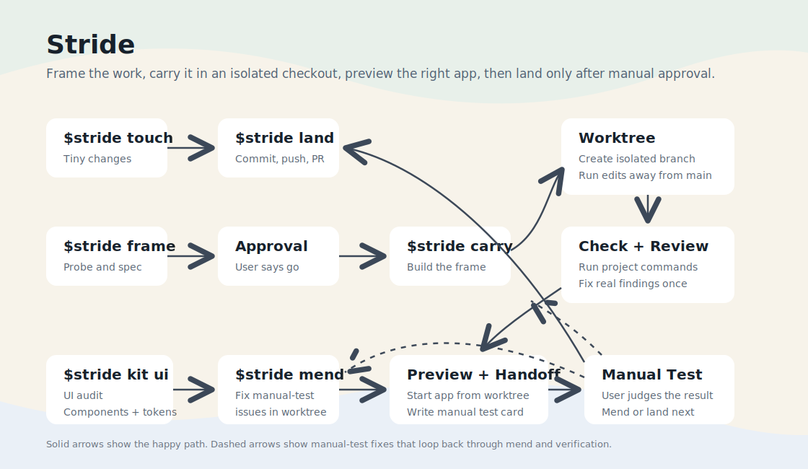

# Stride Workflow

Stride Workflow is a Codex-first workflow tool for keeping repo work specified, isolated, reviewed, and easy to hand off for manual testing.

Default worker split: `stridebuilder` writes, `stridereviewer` reviews, `stridelead` is read-only recon when extra repo facts are worth it, and `strideuiauditor` checks the live UI with Playwright when the change is user-facing.



For the technical workflow, commands, phases, and install details, see [docs/technical-overview.md](docs/technical-overview.md).

## Install

```bash
npx github:jayrmiso/stride-workflow init
```

For a clean reinstall that removes and reapplies the managed Stride files, use:

```bash
stride-workflow refresh
```

## License

MIT
